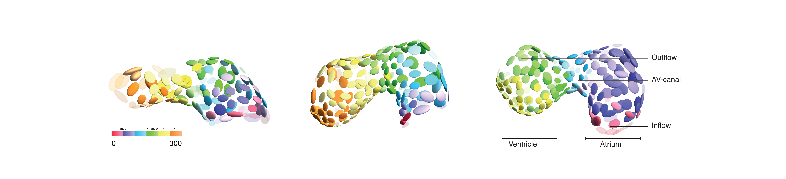

# Single Cell Optical Mapping of Cardiac Activation

This repository contains the scripts to compute the data analysis presented in *Cell-accurate optical mapping across the entire developing heart*. The preprint version can be found on [BioRxiv](https://www.biorxiv.org/content/early/2017/05/27/143057).

*Please note: in order to also download the data for testing (hdf5 and tif files), you need to install git lfs before cloning this repository*

## Structure of the repository

- **data/** contains the unprocessed (but synchronised) images
- **results/** holds everything that has been computed from the raw image data. It contains the following data for an experiment:
	- **extracted-midline/**: the extracted midline as a polyline stored as a Mathematica list in a Wolfram *.m* file.
	- **myl7-H2A-labels/**: the labeled cells from the blob detection (see *src/cell-detection-and-signal-extraction.jl*).
	- **myl7-H2A-processed-labels/**: the labelling computed from manually corrected cell centroids.
	- **myl7-GCaMP5G-from-processed-labels/**: the extracted GCaMP signal readout at each detected cell position.
	- **standard-view-transforms/**: the geometric transformation needed to project the cell positions from the microscopy reference frame to a standard view.
- **src/** contains the actual function definitions and notebooks (in Julia and Mathematica).
	- *analyse-conduction-pattern.nb*: This Mathematica notebook was used to analyse the cellular activation patterns.
	- *analyse-conduction-pattern.cdf*: A computable document format version that can be used without a Mathematica license using the [Wolfram CDF Player](https://www.wolfram.com/cdf-player/)
	- *functions.m*: contains the custom function definitions written for the analysis pipelines (plain text format).
	- *CellAnalyzer.jl*: An experimental Julia implementation of the grayscale blob detection. This file also contains the functions needed to extract the GCaMP signal from the detected cell regions. This code was originlly written and tested with Julia v0.4 but a lot of functionality is deprecated and/or has been removed during updates. The code has been updated to work with v0.6 and current versions of the respective Julia packages, but it has not been fully tested, so you could encounter inconsistencies or problems when using this code.
	- *CellAnalyzer-v0.4.jl*: the original version of the code for Julia v0.4.
	- *cell-detection-and-signal-extraction-demo.ipynb*: A demonstration notebook showing how to use the Julia code from the package.
	- *create-movies.nb*: A Mathematica notebook to create the visualisations and animations shown in the supplementary movies.
	- *correct-cell-detections.nb*: A Mathematica notebook to manually add or remove cell centroids and create an image stack of synthetic, labelled regions around those centroids. The GCaMP signal time series can then be computed for those curated regions (by replacing the label image from the blob detection stage with the synthetic label image in the Julia workflow).
